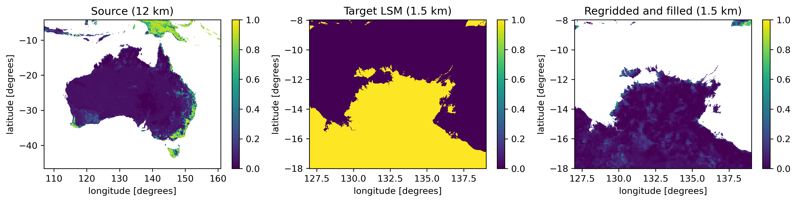

ANTS_regrid.py
--------------

A simple example of using ANTS to:
    1. regrid one ancillary to another grid
    2. fill gaps consistent with a land-sea mask
    3. save output as ancil and netcdf

Example output:

